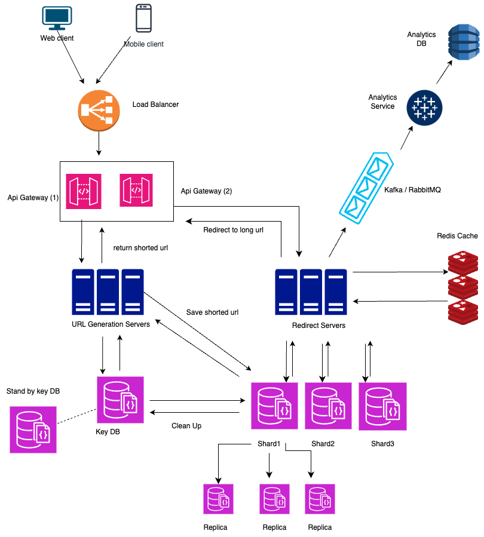
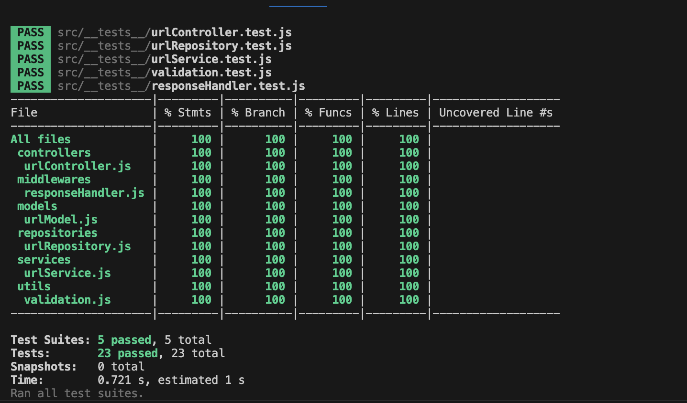

# URL Shortening System

## Overview
This is a simple URL shortening service that allows users to shorten long URLs and retrieve the original long URLs by using short URLs.

## Prerequisites
To run this application, you need to have the following installed:

- [Node.js](https://nodejs.org/) (v14.x or higher)
- [npm](https://www.npmjs.com/) (comes with Node.js)
- [MongoDB](https://www.mongodb.com/) (or your preferred database)

## Installation

1. **Clone the repository:**
    ```bash
    git clone https://github.com/Pirathikaran/shorten-url.git
    ```

2. **Navigate to the project directory:**
    ```bash
    cd shorten-url
    ```

3. **Install the required dependencies:**
    ```bash
    npm install
    ```
## System Diagram


## Code coverage


## Swagger and postman collection
Created two folder in project

when running application can access swagger
http://localhost:3000/api-docs/


## Configuration

Create a `.env` file in the root of the project and add the following configurations:
```env
PORT=3000
MONGO_URI=mongodb://localhost:27017/shorten-url